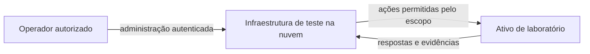

# Por que usar nuvem em testes de segurança autorizados?

## Objetivos da aula

Ao final desta aula, você deverá ser capaz de:

- explicar a arquitetura cliente-servidor;
- identificar benefícios e limites de uma infraestrutura remota de testes;
- compreender conceitualmente callback e Command and Control;
- relacionar escalabilidade a cargas autorizadas;
- explicar por que provedores aumentam, e não eliminam, a rastreabilidade;
- planejar o uso responsável e a limpeza de um laboratório.

Os fundamentos de rede, hospedagem e exposição estão na [Aula 3: O que é computação em nuvem](03-what-is-the-cloud.md). Autorização e escopo estão na [Aula 2: Hacking ético, pentest e Red Team](02-introduction-to-hacking-using-the-cloud.md).

## Arquitetura cliente-servidor

**Cliente** e **servidor** são papéis exercidos por programas durante uma comunicação.

O cliente normalmente inicia uma conexão ou envia uma solicitação. O servidor aguarda comunicações em um endereço e porta lógica, processa os dados e produz uma resposta. Protocolos definem como as mensagens são estruturadas.

Em uma aplicação web, o navegador atua como cliente e o servidor web responde às requisições. Aplicações podem ser:

- **locais:** realizam a maior parte do trabalho no próprio dispositivo;
- **remotas:** dependem principalmente de um serviço externo;
- **híbridas:** dividem processamento e armazenamento entre cliente e servidor.

Um dispositivo pode ser cliente em uma comunicação e servidor em outra. Os papéis descrevem a relação entre processos, não uma categoria permanente de computador.

Ter acesso à Internet não comprova que um aplicativo utiliza nuvem. Ele pode comunicar-se com infraestrutura convencional, serviços de terceiros ou outros dispositivos.

## Infraestrutura remota de testes

Em um laboratório autorizado, a infraestrutura em nuvem pode ocupar uma posição intermediária:

Essa organização pode oferecer:

- provisionamento rápido de máquinas temporárias;
- conectividade estável quando o laboratório exigir alcance público;
- acesso remoto por estações autorizadas;
- separação entre o computador pessoal e o exercício;
- repetição do ambiente por imagens e configurações documentadas;
- aumento temporário de capacidade;
- encerramento dos recursos ao final.

Essas vantagens não surgem automaticamente. Interfaces administrativas precisam de autenticação forte, regras de rede devem ser restritas e dados de laboratório devem permanecer isolados. Serviços públicos também recebem tráfego inesperado da Internet.

O provedor pode restringir varreduras, testes de carga, distribuição de código nocivo e outras atividades. A autorização do alvo não substitui os termos do provedor.

## Callback e C2: visão conceitual

Em uma conexão direta, o sistema do testador inicia a comunicação com o serviço existente no alvo autorizado. Dependendo da arquitetura, conexões de entrada podem não alcançar o ativo por causa de NAT, firewall ou ausência de rota pública.

Um **callback** ocorre quando um agente previamente executado no sistema de laboratório inicia uma conexão de saída para um serviço de controle autorizado. Como a comunicação parte do agente, a sessão pode seguir regras de saída diferentes das aplicadas a conexões de entrada.

Isso não significa que um callback atravesse qualquer controle. O agente precisa estar executando, possuir permissão, resolver e alcançar o destino e utilizar comunicação permitida.

**Command and Control**, abreviado como **C2**, é a infraestrutura usada para coordenar agentes e trocar tarefas e resultados. Em uma simulação autorizada:

1. O operador autentica-se no serviço de controle.
2. O agente de laboratório inicia o callback.
3. O serviço associa a conexão ao exercício autorizado.
4. O operador envia somente tarefas previstas no escopo.
5. O agente executa com os privilégios que já possui.
6. Resultados e registros retornam pelo canal estabelecido.

C2 descreve comunicação e coordenação; não concede automaticamente controle total. O agente continua limitado pelo usuário, processo, sistema operacional, rede e controles existentes.

**EC2** e **C2** não são sinônimos. Amazon EC2 é um serviço de computação da AWS. C2 significa Command and Control.

Esta explicação permanece conceitual porque implantar infraestrutura de controle exige laboratório isolado, autorização específica e medidas contra conexões externas acidentais.

## Escalabilidade aplicada aos testes

A nuvem permite aumentar temporariamente memória, processamento ou quantidade de instâncias. Isso pode ajudar em tarefas autorizadas que possam ser divididas.

Mais recursos não garantem resultado proporcional. Rede, armazenamento, algoritmo, limites do provedor e capacidade do alvo podem ser gargalos. Aumentar concorrência amplia custo e impacto.

Em avaliações, a escala deve ser controlada por:

- limites de taxa e concorrência;
- listas exatas de destinos;
- orçamento e cotas;
- horários autorizados;
- critérios automáticos de interrupção;
- monitoramento do impacto.

Escalar sem esses limites pode causar indisponibilidade ou atingir sistemas fora do escopo.

## Nuvem não significa anonimato

Executar uma atividade a partir da nuvem pode alterar o IP observado pelo alvo, mas não elimina rastros nem rompe a relação com a conta do cliente.

O provedor pode registrar:

- identidade da conta e métodos de autenticação;
- cobrança e verificação;
- chamadas no plano de controle;
- criação, alteração e exclusão de recursos;
- IPs atribuídos e horários de uso;
- mudanças em regras de rede;
- metadados de conexão e eventos de abuso.

O alvo pode registrar endereço de origem, horário, protocolo, requisições e resultados. DNS e registro de domínio também produzem registros.

VPNs e proxies modificam parte do caminho observado pelo destino, mas não oferecem anonimato garantido. Excluir a máquina virtual não apaga necessariamente os registros mantidos pelo provedor ou alvo.

Em um teste legítimo, essa rastreabilidade ajuda a demonstrar que as ações ocorreram dentro do período e escopo autorizados.

## Preparação e encerramento do laboratório

Antes de utilizar recursos:

1. obtenha autorização escrita e confirme o escopo;
2. consulte as políticas atuais do provedor;
3. use projeto ou conta de laboratório separado;
4. restrinja identidades, chaves e regras de rede;
5. defina cotas, orçamento, volume e duração;
6. utilize dados e credenciais fictícios;
7. registre recursos e horários;
8. estabeleça contatos e critérios de interrupção.

Ao terminar:

1. encerre processos e sessões;
2. remova serviços e regras desnecessários;
3. revogue credenciais temporárias;
4. elimine dados conforme o acordo;
5. exclua instâncias, discos, endereços e outros recursos cobrados;
6. confirme que não restaram serviços públicos;
7. verifique custos e preserve apenas evidências autorizadas.

## Correções importantes

- Nem toda aplicação conectada à Internet executa seu trabalho na nuvem.
- Um servidor remoto não está necessariamente disponível o tempo todo.
- Nuvem não garante privacidade ou anonimato.
- Callback não contorna universalmente NAT, firewall ou controles de saída.
- C2 não equivale a controle administrativo.
- Aumentar recursos não acelera toda carga de forma linear.
- Hospedar páginas enganosas ou serviços contra terceiros continua sendo não autorizado.

## Resumo

A nuvem pode fornecer infraestrutura temporária, acessível e escalável para testes autorizados. Cliente e servidor descrevem como os componentes se comunicam, enquanto callbacks permitem que um agente de laboratório inicie uma sessão de saída. Esses mecanismos dependem de rotas, permissões e controles.

O provedor não oferece anonimato: contas, operações e conexões deixam registros. Por isso, a nuvem deve ser usada com autorização, limites, controle de custos e limpeza completa.

## Perguntas de fixação

1. O que define os papéis de cliente e servidor?
2. Por que um aplicativo conectado à Internet não utiliza necessariamente nuvem?
3. Qual é a diferença entre conexão direta e callback?
4. Quais condições precisam existir para um callback funcionar?
5. Por que um agente C2 não possui automaticamente controle total?
6. Qual é a diferença entre EC2 e C2?
7. Como a escalabilidade pode aumentar o risco operacional?
8. Quais registros podem relacionar uma atividade à conta do provedor?
9. Quais verificações devem ser feitas depois de encerrar o laboratório?
