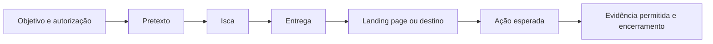

# Phishing e engenharia social

## Objetivos da aula

Esta aula apresenta phishing como processo de engenharia social. Ao final, você deverá compreender:

- o que caracteriza phishing;
- como pretexto, isca, entrega, landing page e ação esperada se relacionam;
- por que uma página web não é, por si só, um ataque;
- como phishing difere de exploração de navegador e malware;
- quais limites devem existir em uma simulação autorizada.

A aula é conceitual. Ela não ensina coleta de credenciais, cookies, tokens ou outros dados reais.

## Limite ético e autorização

Phishing contra terceiros sem autorização pode causar fraude, invasão de privacidade, perda financeira e comprometimento de contas.

Uma simulação somente deve ocorrer:

- em infraestrutura própria ou preparada para o laboratório;
- com autorização explícita do responsável legítimo;
- com escopo, duração e participantes definidos;
- usando identidades, contas e dados fictícios;
- sem solicitar ou armazenar senhas reais;
- com condição clara de encerramento e remoção dos artefatos.

Ser proprietário de um servidor na nuvem não concede autorização para testar pessoas, empresas, marcas ou sistemas externos. Os fundamentos de escopo estão na [aula 2](../01-introduction-to-cloud-computing-for-hackers/02-introduction-to-hacking-using-the-cloud.md).

## Engenharia social

**Engenharia social** é o uso de contexto, comunicação e influência para induzir uma pessoa a realizar determinada ação.

A técnica atua primeiro sobre uma decisão humana. A infraestrutura técnica, como e-mail, página web ou servidor, funciona como meio para apresentar a mensagem ou receber a ação.

Uma falha de software não é obrigatória. Uma pessoa pode ser induzida a clicar, responder ou aprovar algo mesmo quando os programas funcionam como projetados.

## O que é phishing

**Phishing** é uma forma de engenharia social na qual uma mensagem ou interface tenta se passar por comunicação legítima para provocar uma ação.

Essa ação pode ser:

- abrir um link;
- responder a uma mensagem;
- visitar uma página;
- aprovar uma solicitação;
- abrir um arquivo;
- fornecer alguma informação.

Uma página de login falsa é apenas um cenário possível. Phishing não é sinônimo de página clonada nem exige obrigatoriamente uma página web.

## Modelo conceitual

Nem todo cenário utiliza todas as etapas. Uma interação por telefone, por exemplo, pode não possuir landing page.

## Pretexto

O **pretexto** é a narrativa que explica por que o contato está acontecendo e por que a solicitação aparenta fazer sentido.

Ele responde:

- quem supostamente está entrando em contato;
- qual relação teria com o destinatário;
- por que a mensagem chegou naquele momento;
- por que a ação pareceria necessária.

O pretexto é o contexto da história, não necessariamente o elemento que desperta o interesse.

## Isca

A **isca** é o elemento usado para atrair atenção ou motivar a ação.

Pode explorar curiosidade, urgência, recompensa, medo de perder acesso ou desejo de resolver um problema. Em simulação autorizada, deve permanecer nos limites aprovados e não causar dano real.

- O pretexto explica por que a situação pareceria legítima.
- A isca oferece o motivo imediato para agir.

## Entrega

A **entrega** é o canal pelo qual o conteúdo chega ao participante.

Exemplos conceituais:

- e-mail;
- mensagem instantânea;
- SMS;
- ligação;
- código QR;
- rede social;
- comunicação presencial.

O canal não define sozinho se algo é phishing. O que importa é a representação enganosa combinada à tentativa de influenciar uma ação.

Receber a mensagem também não significa que as etapas posteriores ocorreram.

## Landing page

**Landing page** significa página de destino. É a página aberta após um link ou direcionamento.

O termo também é usado legitimamente em marketing e aplicações web. Portanto, landing page não é maliciosa por definição.

Em phishing, ela pode continuar o pretexto da mensagem. Aparência, domínio e comportamento são camadas diferentes:

- aparência é o que o usuário vê;
- domínio identifica o nome na URL;
- servidor entrega os arquivos;
- código determina o comportamento.

Copiar a aparência não transfere a propriedade do domínio original, não compromete o site verdadeiro e não concede acesso às contas de seus usuários.

Nesta etapa, uma página de laboratório deve apenas apresentar conteúdo inofensivo, sem formulários que recebam credenciais ou segredos.

## Ação esperada

A **ação esperada** é o comportamento que o cenário procura provocar.

Ela deve ser definida antes da simulação, pois determina o que está sendo avaliado e qual evidência seria permitida.

Em laboratório seguro, pode ser apenas:

- visitar página de treinamento;
- pressionar botão que não transmite dados pessoais;
- confirmar recebimento de mensagem;
- identificar os componentes do cenário.

“Comprometer uma conta” não é métrica apropriada para exercício introdutório.

## Dependência entre etapas

Cada etapa depende da anterior, mas não garante a seguinte:

1. a mensagem pode ser entregue sem ser lida;
2. o pretexto pode ser compreendido sem convencer;
3. a isca pode chamar atenção sem gerar clique;
4. a landing page pode abrir sem produzir a ação;
5. uma ação pode ocorrer sem exploração ou malware.

Essa separação evita tratar o processo como uma única ferramenta ou vulnerabilidade.

## Phishing, exploração de navegador e malware

| Conceito | Natureza | Relação possível |
|---|---|---|
| **Phishing** | Influência sobre decisão humana | Pode ser canal inicial |
| **Exploração de navegador** | Aproveitamento de vulnerabilidade no navegador ou componente | Um link pode levar a exploit, mas são técnicas distintas |
| **Malware** | Software criado para ações maliciosas ou não autorizadas | Pode ser entregue por phishing, mas não é obrigatório |
| **Coleta de credenciais** | Obtenção de dados de autenticação inseridos por uma pessoa | Possível objetivo abusivo, fora deste laboratório |

Uma página comum não “explora o navegador” apenas por ser carregada. Exploração exige vulnerabilidade ou condição técnica específica.

Um link também não é malware. Malware é código ou software que precisa ser executado ou carregado.

## Alcance entre dispositivos e sistemas

Mensagens e páginas existem em várias plataformas, mas isso não torna um componente técnico universal:

- páginas podem variar entre telas e navegadores;
- exploits dependem da vulnerabilidade e versão;
- malware depende de sistema operacional, arquitetura e condições;
- arquivo para Windows não se torna automaticamente executável no Linux ou macOS.

“Funciona em qualquer dispositivo” não é afirmação técnica válida para exploit ou malware.

## Aparência, HTTPS e confiança

Uma página visualmente semelhante pode pertencer a outra infraestrutura.

HTTPS não afirma que uma organização é legítima. Ele protege a comunicação com o domínio apresentado e permite validar o certificado daquele domínio. Um domínio enganoso também pode usar HTTPS.

Identidade aparente, endereço e comportamento devem ser analisados separadamente.

## Verificação conceitual

Considere este cenário fictício:

> Um instrutor autorizado envia uma mensagem somente a uma conta de teste. A mensagem informa que há uma atividade no portal do laboratório e aponta para `https://treinamento.exemplo.invalid/atividade`. A página mostra “simulação concluída”, não possui formulário e não registra dados pessoais.

| Elemento | Identificação |
|---|---|
| Autorização | Laboratório próprio e conta de teste |
| Pretexto | Existência de atividade do curso |
| Isca | Convite para consultá-la |
| Entrega | Mensagem à conta de teste |
| Landing page | `/atividade` no domínio ilustrativo |
| Ação esperada | Abrir a página |
| Evidência permitida | Confirmação sem dados sensíveis |

O domínio `.invalid` é reservado para exemplos e não representa serviço real.

Se a página explorasse vulnerabilidade, haveria exploração de navegador. Se entregasse código malicioso, haveria malware. Se armazenasse senhas, haveria coleta de credenciais, prática excluída do exercício.

## Próxima aula

Hospedagem, Apache e acesso HTTP serão estudados na [aula 11](11-file-hosting-and-firewall-settings.md) usando conteúdo inofensivo.

## Resumo

- Engenharia social procura influenciar decisões humanas.
- Phishing é técnica de engenharia social, não protocolo ou programa.
- Pretexto fornece narrativa; isca fornece estímulo.
- Entrega transporta a mensagem.
- Landing page é apenas o destino e não é maliciosa por definição.
- A ação esperada deve estar dentro do escopo.
- Phishing, exploração, malware e coleta de credenciais são distintos.
- Simulação introdutória não precisa receber senhas ou dados reais.

## Perguntas de fixação

1. Qual é a relação entre engenharia social e phishing?
2. Qual é a diferença entre pretexto e isca?
3. Por que o canal não define sozinho se algo é phishing?
4. Uma landing page precisa conter login?
5. Por que abrir uma página não significa explorar o navegador?
6. Como malware e phishing podem coexistir sem serem sinônimos?
7. Por que um exploit não funciona automaticamente em todo sistema?
8. O que deve ser definido antes de uma simulação?
9. Como comprovar uma ação sem coletar credenciais?
10. Por que HTTPS não comprova legitimidade?
