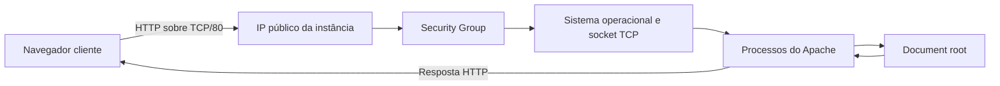

# Apache, HTTP e exposição de um serviço web

## Objetivos da aula

Nesta aula, vamos:

- compreender o Apache HTTP Server;
- diferenciar programa, processo e serviço;
- acompanhar uma requisição HTTP sobre TCP;
- conhecer a porta padrão `80`;
- localizar o document root `/var/www/html`;
- entender `index.html` e o erro `404`;
- instalar pacotes com APT;
- iniciar e verificar o serviço com `systemctl`;
- configurar uma regra HTTP no Security Group;
- distinguir tráfego permitido de serviço ativo.

O laboratório deve usar somente uma instância própria e conteúdo inofensivo. Não hospede malware nem páginas que recebam credenciais reais.

## Pré-requisitos e conexões

Esta aula parte de:

- [Aula 3: o que é a nuvem](../01-introduction-to-cloud-computing-for-hackers/03-what-is-the-cloud.md), para máquina remota, IP e porta;
- [Aula 8: SSH](../02-cloud-basics/08-communicating-with-cloud-computers-remotely-using-ssh.md), para acessar a instância;
- [Aula 9: terminal Linux](../02-cloud-basics/09-linux-terminal-basics.md), para comandos e caminhos;
- [Aula 10: phishing](10-introduction-to-phishing.md), para separar infraestrutura web de influência social.

Os comandos são executados no Kali remoto depois da conexão SSH.

## O que é o Apache

**Apache HTTP Server** é um software servidor web. No Kali e em outras distribuições baseadas em Debian, o pacote normalmente se chama `apache2`.

| Elemento | Significado |
|---|---|
| Máquina servidora | Computador ou VM que fornece recursos |
| Software servidor | Programa que implementa protocolo, como Apache |
| Processo | Instância de programa em execução |
| Serviço | Função de longa duração gerenciada pelo sistema |

O Apache instalado é um conjunto de arquivos no disco. Quando iniciado, cria um ou mais processos. O sistema gerencia essa função como o serviço `apache2`.

Um serviço pode possuir vários processos. Reiniciá-lo pode produzir novos IDs sem alterar o nome lógico.

## HTTP sobre TCP e IP

**HTTP**, ou *Hypertext Transfer Protocol*, é um protocolo da camada de aplicação usado para trocar requisições e respostas web.

Neste cenário:

1. HTTP define a requisição e a resposta.
2. TCP estabelece a conexão e transporta bytes ordenados.
3. IP encaminha pacotes entre origem e destino.
4. A porta identifica qual aplicação deve receber a conexão.

A porta padrão do HTTP é `80`. Assim:

```text
http://<IP-PUBLICO-DO-LAB>/
```

equivale, quanto à porta, a:

```text
http://<IP-PUBLICO-DO-LAB>:80/
```

## Fluxo de uma requisição



Fluxo simplificado:

1. o navegador inicia TCP com o IP público na porta `80`;
2. a AWS encaminha o tráfego até a interface;
3. o Security Group verifica a entrada;
4. o sistema entrega a conexão ao processo em escuta;
5. o Apache interpreta a requisição HTTP;
6. localiza o conteúdo;
7. a resposta retorna pela conexão.

Permitir tráfego no Security Group não cria o Apache. Iniciar Apache também não altera automaticamente o Security Group.

## Requisição e resposta HTTP

Requisição simplificada:

```http
GET /files/one.jpg HTTP/1.1
Host: <IP-PUBLICO-DO-LAB>
```

- `GET`: método que solicita recurso;
- `/files/one.jpg`: caminho solicitado;
- `HTTP/1.1`: versão do protocolo;
- `Host`: servidor de destino.

Resposta de sucesso pode começar assim:

```http
HTTP/1.1 200 OK
Content-Type: image/jpeg
```

Se o recurso não existir:

```http
HTTP/1.1 404 Not Found
```

Um `404` é resposta HTTP: a comunicação chegou ao servidor web, mas o caminho não correspondeu a um recurso disponível.

Erro de conexão ou timeout acontece antes de existir resposta HTTP e deve ser investigado em outra camada.

## Document root

O **document root** é o diretório usado pelo Apache como ponto inicial para servir arquivos.

No Kali ou Debian, uma configuração comum usa:

```text
/var/www/html
```

| Caminho da URL | Possível caminho no servidor |
|---|---|
| `/` | `/var/www/html/index.html` |
| `/files/one.jpg` | `/var/www/html/files/one.jpg` |
| `/pagina.html` | `/var/www/html/pagina.html` |

Essa associação pode ser alterada. O navegador não recebe acesso livre ao sistema de arquivos; o Apache decide quais recursos servir.

## O papel de `index.html`

Quando a URL termina em `/`, solicita um diretório, não um arquivo específico. O Apache normalmente procura um arquivo de índice, frequentemente `index.html`.

Assim, a requisição:

```text
http://<IP-PUBLICO-DO-LAB>/
```

pode enviar:

```text
/var/www/html/index.html
```

O nome e comportamento dependem da configuração.

## APT e privilégios administrativos

Kali usa APT para gerenciar pacotes.

### Atualizar o índice

```bash
sudo apt update
```

```text
sudo apt update
├─ sudo: executa com privilégio autorizado
├─ apt: gerenciador de pacotes
├─ update: atualiza índices locais dos repositórios
└─ verificação: confirme a conclusão sem erros
```

`apt update` não atualiza automaticamente todos os programas. Obtém metadados recentes sobre pacotes disponíveis.

`sudo` executa o comando seguinte com privilégios conforme a política. Não transforma permanentemente a sessão em `root`.

### Instalar Apache

```bash
sudo apt install apache2
```

```text
sudo apt install apache2
├─ sudo: elevação autorizada
├─ apt: gerenciador de pacotes
├─ install: instala pacote
├─ apache2: nome do pacote
└─ verificação: consulte o serviço depois
```

Leia dependências e espaço informado pelo APT antes de confirmar.

PHP não é necessário para servir HTML estático e não precisa ser instalado nesta aula.

## Gerenciamento do serviço

Em sistemas com `systemd`, `systemctl` gerencia serviços.

### Iniciar

```bash
sudo systemctl start apache2
```

```text
sudo systemctl start apache2
├─ sudo: elevação autorizada
├─ systemctl: gerencia unidades do systemd
├─ start: solicita inicialização
├─ apache2: serviço
└─ verificação: systemctl is-active apache2
```

Ausência de mensagem não é verificação suficiente.

### Verificar

```bash
systemctl is-active apache2
```

Para detalhes sem paginador:

```bash
systemctl --no-pager status apache2
```

- `--no-pager`: imprime diretamente;
- `status`: mostra estado e mensagens recentes;
- `apache2`: unidade consultada.

### Alternativa com `service`

```bash
sudo service apache2 start
```

`service` é uma interface de compatibilidade. Não é necessário executar `service` e `systemctl` para a mesma ação. Prefira `systemctl` quando houver systemd.

## Verificar a porta em escuta

```bash
sudo ss -ltnp 'sport = :80'
```

```text
ss -ltnp 'sport = :80'
├─ ss: consulta sockets
├─ -l: mostra sockets em escuta
├─ -t: limita a TCP
├─ -n: mantém números
├─ -p: mostra o processo, quando permitido
├─ filtro: porta local 80
└─ verificação: procure listener associado ao servidor web
```

Um listener `0.0.0.0:80` significa que o processo aceita conexões na porta `80` das interfaces IPv4 locais. Isso não é igual a `0.0.0.0/0` em Security Group.

## Testar localmente

Antes de investigar a AWS:

```bash
curl -I http://127.0.0.1/
```

```text
curl -I http://127.0.0.1/
├─ curl: cliente de protocolos
├─ -I: solicita apenas cabeçalhos HTTP
├─ 127.0.0.1: loopback da própria máquina
├─ porta: 80 por padrão
└─ verificação: procure uma linha de estado HTTP
```

Esse teste não atravessa Internet nem Security Group. Qualquer resposta HTTP demonstra que um servidor respondeu; o código informa o resultado.

## Examinar o document root

```bash
ls -la /var/www/html
```

```text
ls -la /var/www/html
├─ ls: lista conteúdo
├─ -l: formato detalhado
├─ -a: inclui ocultos
└─ /var/www/html: document root
```

Para `/files/one.jpg`:

```bash
ls -l /var/www/html/files/one.jpg
```

Não use `chmod 777` como correção genérica. Identifique qual usuário precisa de qual acesso.

## Security Group

Um **Security Group** é um controle virtual de tráfego associado à interface da instância.

Para HTTP, uma regra costuma conter:

```text
Tipo: HTTP
Protocolo: TCP
Porta de destino: 80
Origem: faixa CIDR autorizada
```

A regra permite que conexões compatíveis cheguem à instância. Não instala, inicia ou configura Apache.

Security Groups mantêm o estado das conexões. Quando uma entrada é permitida, a resposta correspondente pode retornar.

## O significado de `0.0.0.0/0`

Em CIDR:

```text
0.0.0.0/0
```

significa **qualquer endereço IPv4 de origem**.

O prefixo `/0` fixa zero bits. Como nenhum precisa coincidir, toda a faixa IPv4 é abrangida.

Essa origem:

- não representa o IP da instância;
- não seleciona automaticamente a própria máquina;
- permite conexões de qualquer IPv4;
- deve ser usada somente quando exposição pública for intencional e autorizada.

Para somente um IPv4:

```text
<SEU-IP-PUBLICO>/32
```

O equivalente para qualquer origem IPv6 é `::/0`.

## Configuração no laboratório AWS

1. Abra o Security Group associado.
2. Edite regras de entrada.
3. Adicione `HTTP`.
4. Confirme TCP e porta `80`.
5. Selecione origem adequada ao escopo.
6. Salve.
7. Teste com o IP público atual.

Para teste somente do estudante, use o IP público atual com `/32`. Use `0.0.0.0/0` apenas se o objetivo autorizado exigir acesso público.

A instância ainda precisa de endereço público e rota válida. O Security Group é apenas uma condição.

## Porta permitida versus serviço ativo

| TCP/80 permitido | Apache escutando | Resultado |
|---|---|---|
| Não | Não | Sem serviço e sem entrada permitida |
| Não | Sim | Teste local pode funcionar; público bloqueado |
| Sim | Não | Tráfego chega, mas não há processo para atender |
| Sim | Sim | Pode funcionar se endereço, rota e controles estiverem corretos |

No painel AWS, a regra apenas permite tráfego. Para a porta responder, a conexão precisa alcançar um processo em escuta.

## Verificação em camadas

1. confirme que o pacote foi instalado;
2. consulte `systemctl is-active apache2`;
3. use `ss` para procurar TCP/80;
4. teste localmente com `curl`;
5. confira o Security Group;
6. confirme o IP atual;
7. abra `http://<IP-PUBLICO-DO-LAB>/`;
8. interprete o resultado.

Essa ordem separa problemas do Apache de problemas de rede.

## Interpretação de falhas

| Resultado | Interpretação inicial |
|---|---|
| `curl` local falha | Serviço, listener ou configuração local |
| `curl` local funciona, público falha | Security Group, IP, rota ou outro controle |
| Conexão recusada | Destino alcançado, sem listener ou rejeição local |
| Tempo esgotado | Tráfego filtrado, sem rota ou sem resposta |
| Página padrão | Serviço e caminho padrão funcionando |
| `404 Not Found` | Apache respondeu, mas não encontrou o recurso |
| `403 Forbidden` | Apache respondeu, mas recusou o recurso |

Não altere várias camadas ao mesmo tempo. Faça uma mudança e repita a verificação correspondente.

## Encerramento

```bash
sudo systemctl stop apache2
```

Depois:

1. verifique o estado e a porta;
2. remova a regra temporária TCP/80;
3. confirme que a exposição terminou;
4. pare ou termine a instância;
5. verifique custos.

## Correções da transcrição

- O termo correto é **document root**, não “rota da Web”.
- O caminho é `/var/www/html`.
- `0.0.0.0/0` significa qualquer origem IPv4, não o IP da instância.
- Liberar TCP/80 não inicia Apache.
- Iniciar Apache não garante acesso público.
- Comando sem erro visível deve ser verificado.
- PHP não é necessário para `index.html` estático.
- `404` é resposta válida para recurso não encontrado.

## Resumo

- Apache é software servidor web gerenciado como `apache2`.
- HTTP define requisições e respostas e usa TCP/80 neste laboratório.
- Security Group filtra a entrada antes do serviço.
- `/var/www/html` é um document root padrão comum.
- `index.html` costuma ser recurso padrão.
- `apt update` atualiza índices; `apt install` instala.
- `systemctl` inicia e verifica o serviço.
- Serviço ativo e tráfego permitido são condições distintas.
- `0.0.0.0/0` abrange qualquer IPv4.
- Testes locais devem anteceder o teste público.

## Perguntas de fixação

1. Qual é a diferença entre máquina, software servidor, processo e serviço?
2. Qual função pertence a HTTP, TCP e IP?
3. O que a porta `80` identifica?
4. Por que Security Group não inicia Apache?
5. O que `0.0.0.0/0` representa?
6. Qual é a diferença entre `0.0.0.0:80` e `0.0.0.0/0`?
7. Para qual arquivo uma requisição a `/` pode ser mapeada?
8. O que um `404` comprova?
9. Qual é a diferença entre `apt update` e `apt install apache2`?
10. Por que testar com `curl` antes da AWS?
11. Se Apache funciona localmente, mas não pelo IP público, o que verificar?
12. Quais ações encerram corretamente o laboratório?
