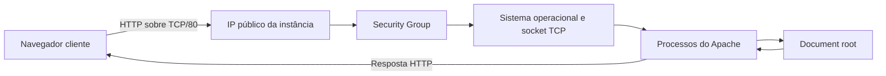

# Apache, HTTP e exposição de um serviço web

O laboratório deve usar somente uma instância própria e conteúdo inofensivo. Não hospede malware nem páginas que recebam credenciais reais.

Esta aula aplica máquina remota, IP e porta da [aula 3](../01-introduction-to-cloud-computing-for-hackers/03-what-is-the-cloud.md), o acesso SSH da [aula 8](../02-cloud-basics/08-communicating-with-cloud-computers-remotely-using-ssh.md), os comandos e caminhos da [aula 9](../02-cloud-basics/09-linux-terminal-basics.md) e a distinção entre infraestrutura web e influência social da [aula 10](10-introduction-to-phishing.md).

Os comandos são executados no Kali remoto depois da conexão SSH.

## O que é o Apache

**Apache HTTP Server** é um software servidor web. No Kali e em outras distribuições baseadas em Debian, o pacote normalmente se chama `apache2`.

Uma **máquina servidora** é o computador ou a VM que fornece recursos. O **software servidor**, como Apache, implementa o protocolo. Quando esse programa é iniciado, surge um **processo** em execução; o sistema administra essa função de longa duração como um **serviço**.

O Apache instalado é um conjunto de arquivos no disco. Quando iniciado, cria um ou mais processos. O sistema gerencia essa função como o serviço `apache2`.

Um serviço pode possuir vários processos. Reiniciá-lo pode produzir novos IDs sem alterar o nome lógico.

## HTTP sobre TCP e IP

**HTTP**, ou *Hypertext Transfer Protocol*, é um protocolo da camada de aplicação usado para trocar requisições e respostas web.

Neste cenário, HTTP define a requisição e a resposta, TCP estabelece a conexão e transporta bytes ordenados, IP encaminha os pacotes e a porta identifica qual aplicação deve recebê-los.

A porta padrão do HTTP é `80`. Assim:

```text
http://<IP-PUBLICO-DO-LAB>/
```

equivale, quanto à porta, a:

```text
http://<IP-PUBLICO-DO-LAB>:80/
```

## Fluxo de uma requisição



O navegador inicia TCP com o IP público na porta `80`, e a AWS encaminha o tráfego até a interface. O Security Group verifica a entrada; o sistema entrega a conexão ao processo em escuta; o Apache interpreta a requisição HTTP, localiza o conteúdo e devolve a resposta pela conexão.

Permitir tráfego no Security Group não cria o Apache. Iniciar Apache também não altera automaticamente o Security Group.

## Requisição e resposta HTTP

Requisição simplificada:

```http
GET /files/one.jpg HTTP/1.1
Host: <IP-PUBLICO-DO-LAB>
```

- `GET`: método que solicita recurso;
- `/files/one.jpg`: caminho solicitado;
- `HTTP/1.1`: versão do protocolo;
- `Host`: servidor de destino.

Resposta de sucesso pode começar assim:

```http
HTTP/1.1 200 OK
Content-Type: image/jpeg
```

Se o recurso não existir:

```http
HTTP/1.1 404 Not Found
```

Um `404` é resposta HTTP: a comunicação chegou ao servidor web, mas o caminho não correspondeu a um recurso disponível.

Erro de conexão ou timeout acontece antes de existir resposta HTTP e deve ser investigado em outra camada.

## Document root

O **document root** é o diretório usado pelo Apache como ponto inicial para servir arquivos.

No Kali ou Debian, uma configuração comum usa:

```text
/var/www/html
```

Uma requisição para `/` pode corresponder a `/var/www/html/index.html`. `/files/one.jpg` pode levar a `/var/www/html/files/one.jpg`, enquanto `/pagina.html` pode ser atendido por `/var/www/html/pagina.html`.

Essa associação pode ser alterada. O navegador não recebe acesso livre ao sistema de arquivos; o Apache decide quais recursos servir.

## O papel de `index.html`

Quando a URL termina em `/`, solicita um diretório, não um arquivo específico. O Apache normalmente procura um arquivo de índice, frequentemente `index.html`.

Assim, a requisição:

```text
http://<IP-PUBLICO-DO-LAB>/
```

pode enviar:

```text
/var/www/html/index.html
```

O nome e comportamento dependem da configuração.

## APT e privilégios administrativos

Kali usa APT para gerenciar pacotes.

### Atualizar o índice

```bash
sudo apt update
```

`sudo` executa a operação com privilégio autorizado, `apt` é o gerenciador de pacotes e `update` atualiza os índices locais dos repositórios. Confirme a conclusão sem erros.

`apt update` não atualiza automaticamente todos os programas. Obtém metadados recentes sobre pacotes disponíveis.

`sudo` executa o comando seguinte com privilégios conforme a política. Não transforma permanentemente a sessão em `root`.

### Instalar Apache

```bash
sudo apt install apache2
```

Aqui, `install` solicita a instalação e `apache2` é o pacote escolhido. Leia dependências e espaço informado pelo APT antes de confirmar e consulte o serviço depois.

Leia dependências e espaço informado pelo APT antes de confirmar.

PHP não é necessário para servir HTML estático e não precisa ser instalado nesta aula.

## Gerenciamento do serviço

Em sistemas com `systemd`, `systemctl` gerencia serviços.

### Iniciar

```bash
sudo systemctl start apache2
```

`systemctl` administra unidades do systemd, `start` solicita a inicialização e `apache2` identifica o serviço. Verifique o resultado com `systemctl is-active apache2`.

Ausência de mensagem não é verificação suficiente.

### Verificar

```bash
systemctl is-active apache2
```

Para detalhes sem paginador:

```bash
systemctl --no-pager status apache2
```

- `--no-pager`: imprime diretamente;
- `status`: mostra estado e mensagens recentes;
- `apache2`: unidade consultada.

### Alternativa com `service`

```bash
sudo service apache2 start
```

`service` é uma interface de compatibilidade. Não é necessário executar `service` e `systemctl` para a mesma ação. Prefira `systemctl` quando houver systemd.

## Verificar a porta em escuta

```bash
sudo ss -ltnp 'sport = :80'
```

`ss` consulta sockets. As opções mostram apenas sockets em escuta, limitam o resultado a TCP, mantêm números e incluem o processo quando permitido. O filtro seleciona a porta local `80`; procure um listener associado ao servidor web.

Um listener `0.0.0.0:80` significa que o processo aceita conexões na porta `80` das interfaces IPv4 locais. Isso não é igual a `0.0.0.0/0` em Security Group.

## Testar localmente

Antes de investigar a AWS:

```bash
curl -I http://127.0.0.1/
```

`curl` é o cliente, `-I` solicita apenas os cabeçalhos e `127.0.0.1` aponta para a própria máquina. Como a URL usa HTTP sem indicar outra porta, o destino padrão é `80`. Procure uma linha de estado HTTP.

Esse teste não atravessa Internet nem Security Group. Qualquer resposta HTTP demonstra que um servidor respondeu; o código informa o resultado.

## Examinar o document root

```bash
ls -la /var/www/html
```

`ls` lista o conteúdo, `-l` usa o formato detalhado, `-a` inclui itens ocultos e `/var/www/html` é o document root examinado.

Para `/files/one.jpg`:

```bash
ls -l /var/www/html/files/one.jpg
```

Não use `chmod 777` como correção genérica. Identifique qual usuário precisa de qual acesso.

## Security Group

Um **Security Group** é um controle virtual de tráfego associado à interface da instância.

Para HTTP, uma regra normalmente seleciona o tipo HTTP, protocolo TCP, porta de destino `80` e uma faixa CIDR de origem autorizada.

A regra permite que conexões compatíveis cheguem à instância. Não instala, inicia ou configura Apache.

Security Groups mantêm o estado das conexões. Quando uma entrada é permitida, a resposta correspondente pode retornar.

## O significado de `0.0.0.0/0`

Em CIDR:

```text
0.0.0.0/0
```

significa **qualquer endereço IPv4 de origem**.

O prefixo `/0` fixa zero bits. Como nenhum precisa coincidir, toda a faixa IPv4 é abrangida.

Essa origem:

- não representa o IP da instância;
- não seleciona automaticamente a própria máquina;
- permite conexões de qualquer IPv4;
- deve ser usada somente quando exposição pública for intencional e autorizada.

Para somente um IPv4:

```text
<SEU-IP-PUBLICO>/32
```

O equivalente para qualquer origem IPv6 é `::/0`.

## Configurando o acesso no laboratório AWS

Abra o Security Group associado e edite suas regras de entrada. Adicione HTTP, confirme TCP e porta `80`, selecione uma origem adequada ao escopo e salve. Então teste com o IP público atual.

Para teste somente do estudante, use o IP público atual com `/32`. Use `0.0.0.0/0` apenas se o objetivo autorizado exigir acesso público.

A instância ainda precisa de endereço público e rota válida. O Security Group é apenas uma condição.

## Porta permitida versus serviço ativo

| TCP/80 permitido | Apache escutando | Resultado |
|---|---|---|
| Não | Não | Sem serviço e sem entrada permitida |
| Não | Sim | Teste local pode funcionar; público bloqueado |
| Sim | Não | Tráfego chega, mas não há processo para atender |
| Sim | Sim | Pode funcionar se endereço, rota e controles estiverem corretos |

No painel AWS, a regra apenas permite tráfego. Para a porta responder, a conexão precisa alcançar um processo em escuta.

## Verificando uma camada de cada vez

Comece confirmando que o pacote foi instalado e consulte `systemctl is-active apache2`. Use `ss` para procurar o listener TCP/80 e teste localmente com `curl`. Só então confira o Security Group, confirme o IP atual e abra `http://<IP-PUBLICO-DO-LAB>/`. Essa ordem separa problemas do Apache de problemas de rede.

## Interpretação de falhas

| Resultado | Interpretação inicial |
|---|---|
| `curl` local falha | Serviço, listener ou configuração local |
| `curl` local funciona, público falha | Security Group, IP, rota ou outro controle |
| Conexão recusada | Destino alcançado, sem listener ou rejeição local |
| Tempo esgotado | Tráfego filtrado, sem rota ou sem resposta |
| Página padrão | Serviço e caminho padrão funcionando |
| `404 Not Found` | Apache respondeu, mas não encontrou o recurso |
| `403 Forbidden` | Apache respondeu, mas recusou o recurso |

Não altere várias camadas ao mesmo tempo. Faça uma mudança e repita a verificação correspondente.

## Encerramento

```bash
sudo systemctl stop apache2
```

Depois, verifique o estado e a porta, remova a regra temporária TCP/80 e confirme que a exposição terminou. Pare ou termine a instância e verifique os custos.

O termo correto é **document root**, e o caminho usado nesta aula é `/var/www/html`. `0.0.0.0/0` significa qualquer origem IPv4, não o IP da instância. Liberar TCP/80 não inicia Apache, iniciar Apache não garante acesso público, PHP não é necessário para um `index.html` estático e um `404` comprova que houve resposta HTTP, embora o recurso não tenha sido encontrado.
