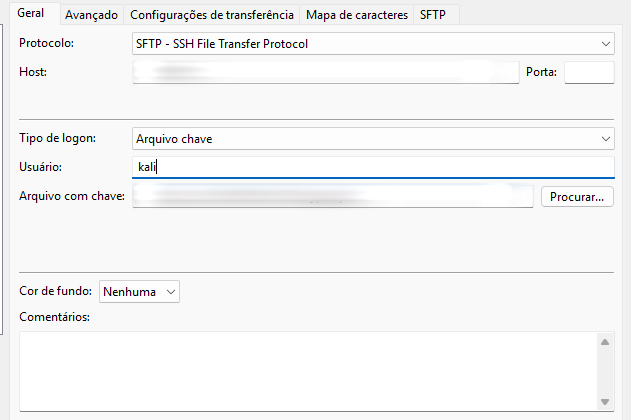
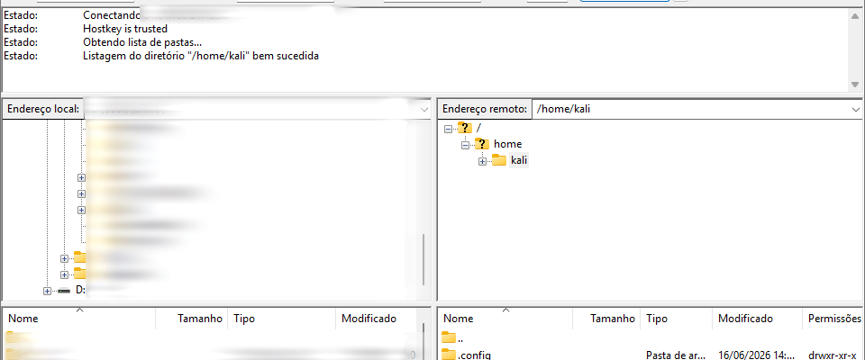

# Clonando páginas e enviando arquivos para a nuvem

> **Título original:** Cloning Websites & Uploading Them to The Cloud  
> **Duração:** 8 minutos  
> **Escopo:** use somente páginas próprias ou criadas para um laboratório autorizado.

Esta aula reúne a [instância Kali e seu key pair](../02-cloud-basics/07-installing-kali-linux-on-the-cloud.md), o [acesso SSH](../02-cloud-basics/08-communicating-with-cloud-computers-remotely-using-ssh.md), os [caminhos do Linux](../02-cloud-basics/09-linux-terminal-basics.md) e o [servidor Apache](11-file-hosting-and-firewall-settings.md). O conteúdo novo é a cópia estática de uma página, o protocolo SFTP e o uso do FileZilla.

## Cópia estática de uma página

Ao escolher **Salvar página como → Página da Web, completa**, o navegador tenta guardar no computador os arquivos que recebeu para exibir a página, como:

- **HTML:** estrutura e conteúdo textual;
- **CSS:** regras de aparência;
- **JavaScript:** código enviado ao navegador;
- imagens, fontes e outros recursos acessíveis.

O resultado é uma **cópia estática local**. Ela representa parte do que o navegador recebeu, mas não reproduz todo o sistema original.

Normalmente não são copiados:

- código de back-end executado no servidor;
- banco de dados;
- lógica real de autenticação;
- APIs privadas;
- sessões de usuários;
- serviços externos;
- conteúdo obtido dinamicamente depois do carregamento.

URLs absolutas, recursos externos e controles como CSP e CORS também podem fazer a cópia aparecer incompleta.

> [!NOTE]
> Abrir o arquivo salvo no navegador não o publica na Internet. Ele continua armazenado somente no computador local.

Para estudar a transferência, crie ou salve uma página inofensiva do próprio laboratório. Não publique cópias de marcas ou formulários reais. Uma página segura pode conter um título, texto informativo e uma imagem sem dados pessoais, mas não deve ter campo de senha nem enviar informações.

O objetivo desta aula é aprender infraestrutura e transferência de arquivos, não coletar credenciais.

## O que é SFTP

**SFTP** significa **SSH File Transfer Protocol**. É um protocolo para manipular arquivos remotos dentro de uma sessão SSH.

Ele permite listar diretórios, enviar arquivos por **upload**, baixar por **download**, criar, renomear ou remover itens quando o usuário possui permissão e consultar tamanho, data e permissões.

Como SFTP utiliza o SSH configurado na [aula 8](../02-cloud-basics/08-communicating-with-cloud-computers-remotely-using-ssh.md), normalmente usa a mesma conexão TCP na porta `22`, a mesma conta `kali` e a mesma chave privada.

### SFTP não é FTP

| Tecnologia | Proteção | Porta comum | Observação |
|---|---|---:|---|
| FTP | Sem criptografia nativa | `21` | Tecnologia antiga; autenticação e dados podem ficar expostos. |
| FTPS | FTP protegido com TLS | Varia | Continua sendo FTP, com TLS adicionado. |
| SFTP | Canal criptografado do SSH | `22` | Protocolo diferente, usado nesta aula. |

A frase “FTP sobre SSH” da tradução é uma simplificação imprecisa. SFTP não é uma sessão FTP comum encapsulada; é um protocolo próprio que utiliza a infraestrutura do SSH.

## O que é o FileZilla Client

O **FileZilla Client** é um programa com interface gráfica para transferir arquivos entre o computador local e um servidor remoto.

Nesta aula, o FileZilla é executado no Windows e a instância Kali é o destino remoto. A conexão usa SFTP, fornecido pela infraestrutura SSH já instalada no Kali.

Não é necessário instalar **FileZilla Server**. Também não é necessário liberar outra porta para o FileZilla: SFTP reutiliza a porta `22` do SSH.

## Preparando os dois lados

No Windows, são necessários o [FileZilla Client](https://filezilla-project.org/download.php?type=client), o navegador, a chave privada `.pem` correspondente e a página inofensiva com seus recursos. Na AWS, a instância precisa estar em execução, com IP público ou DNS atual, usuário remoto `kali` e SSH acessível conforme a [aula 8](../02-cloud-basics/08-communicating-with-cloud-computers-remotely-using-ssh.md).

Mantenha a chave privada fora da pasta da página, do diretório publicado e de repositórios.

## Configurando o FileZilla

Abra **Arquivo → Gerenciador de Sites → Novo site** e informe:

| Campo | Valor do laboratório |
|---|---|
| Nome do site | Nome descritivo, como `AWS Kali` |
| Protocolo | `SFTP - SSH File Transfer Protocol` |
| Host | IP público ou DNS atual da instância |
| Porta | `22` ou vazio para usar a porta padrão |
| Tipo de logon | Arquivo de chave |
| Usuário | `kali` |
| Arquivo de chave | Chave privada correspondente à instância |

*Figura 1: Configuração do cliente SFTP. O IP e o caminho da chave privada estão desfocados.*

Na primeira conexão, o FileZilla pode pedir confirmação da chave de host. Compare a fingerprint por uma fonte confiável, conforme explicado na [aula 8](../02-cloud-basics/08-communicating-with-cloud-computers-remotely-using-ssh.md), antes de aceitar.

## Lendo a interface

O painel esquerdo mostra os arquivos do computador local, enquanto o direito mostra o sistema de arquivos da instância Kali. A área superior registra conexão e operações; a inferior apresenta fila, transferências concluídas e falhas.

Arrastar um arquivo da esquerda para a direita realiza upload. Arrastar da direita para a esquerda realiza download.

*Figura 2: O computador local aparece à esquerda e o sistema de arquivos remoto à direita. Dados particulares estão desfocados.*

## Transferindo a página para o Kali

No painel local, abra a pasta da página e confirme que o HTML permanece junto de seus recursos. No painel remoto, abra `/home/kali` e arraste os arquivos para esse lado. Acompanhe a fila e o log, atualize a listagem remota e compare nome, tamanho e data dos itens recebidos.

O FileZilla pode manter uma listagem antiga na tela. Use **Atualizar** quando uma alteração não aparecer imediatamente.

## Transferir não é publicar

Estes diretórios têm funções diferentes:

| Diretório | Função nesta aula |
|---|---|
| `/home/kali` | Diretório pessoal do usuário; local adequado para receber e conferir arquivos. |
| `/var/www/html` | Document root comum do Apache; arquivos ali podem ser servidos por HTTP. |

Uma conexão SFTP bem-sucedida e um arquivo em `/home/kali` não provam que a página está pública.

Para publicar uma página própria no laboratório, o arquivo precisa ser colocado no document root correto, ter permissões adequadas e ser servido pelo Apache. Esse fluxo está explicado na [aula 11](11-file-hosting-and-firewall-settings.md).

## O que as capturas comprovam

As capturas mostram o perfil SFTP configurado, a autenticação com o usuário `kali`, a listagem de `/home/kali` e os dois lados disponíveis para transferência.

A mensagem **“Listagem do diretório `/home/kali` bem sucedida”** comprova conexão e autorização para listar esse diretório. Ela não comprova, sozinha, que um upload terminou nem que o Apache publicou o arquivo.

Para comprovar um upload, o status precisa indicar conclusão, o arquivo deve aparecer no painel remoto com nome e tamanho esperados e continuar presente depois de uma nova listagem.

A tradução “FTP sobre SSH” é imprecisa: SFTP é um protocolo próprio executado dentro do SSH. O usuário reconhecido como “Carly” é `kali`; “var HTML” refere-se a `/var/www/html`; e “Localizador” refere-se ao Finder do macOS, equivalente ao Explorador de Arquivos no Windows.

## Problemas comuns

| Sintoma | Verificação |
|---|---|
| Tempo limite | Siga o diagnóstico de rede e porta `22` da [aula 8](../02-cloud-basics/08-communicating-with-cloud-computers-remotely-using-ssh.md). |
| Falha de autenticação | Confira usuário, chave correspondente e permissões da chave. |
| Aviso de chave de host alterada | Interrompa e valide a nova fingerprint antes de confiar. |
| `Permission denied` | Confirme o diretório remoto e as permissões do usuário `kali`. |
| Arquivo não aparece | Atualize a listagem e confira a fila de transferências. |
| HTML abre sem imagens ou CSS | Envie também a pasta de recursos e confira os caminhos. |
| Upload funciona, mas o site não aparece | O arquivo pode estar em `/home/kali`, não em `/var/www/html`. |
| Página remota retorna `403` ou `404` | Consulte permissões, document root e caminhos na [aula 11](11-file-hosting-and-firewall-settings.md). |

## Encerrando a transferência

Esta atividade pode deixar um perfil salvo no FileZilla, registro da chave de host conhecida, autenticação SSH, operações no log e arquivos novos no sistema remoto, além de eventual cópia posterior no document root.

Registre apenas evidências necessárias e remova os arquivos de teste quando terminar.

## Perguntas de fixação

1. Quais arquivos uma cópia estática pode salvar, quais componentes do servidor não são copiados e por que abrir o HTML local não o publica?
2. Qual é a diferença técnica entre FTP, FTPS e SFTP?
3. Por que o FileZilla reutiliza o SSH, a porta TCP `22`, o usuário `kali` e a mesma chave privada?
4. Quais valores devem ser informados nos campos protocolo, host, porta, tipo de logon, usuário e arquivo de chave?
5. O que a confirmação da chave de host protege e por que a fingerprint deve ser comparada?
6. O que representam os painéis esquerdo e direito, o log superior e a fila inferior do FileZilla?
7. Qual é a diferença entre arrastar um arquivo da esquerda para a direita e da direita para a esquerda?
8. Por que HTML, CSS, JavaScript e imagens precisam manter caminhos e estrutura compatíveis no upload?
9. Qual é a diferença entre armazenar o arquivo em `/home/kali` e publicá-lo a partir de `/var/www/html`?
10. O que a mensagem de listagem bem-sucedida comprova e o que ainda não comprova?
11. Quais evidências confirmam que a transferência terminou e como distinguir timeout, autenticação e permissão negada?
12. Por que a chave privada deve permanecer fora da pasta da página, do document root e do repositório?
