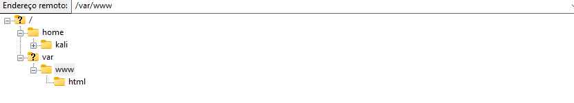
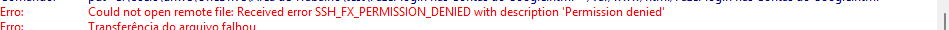
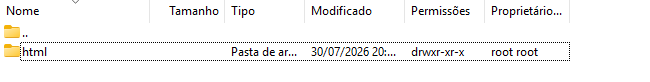
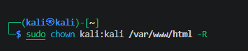
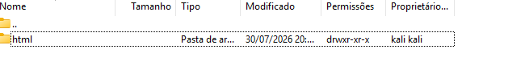

# Publicando uma página de laboratório no Apache

> **Status:** capítulo em revisão editorial.
>
> **Título original:** Creating a Fake Login Page on The Cloud
>
> **Escopo:** laboratório próprio, isolado e autorizado. Use uma página fictícia, sem marca real, senha ou coleta de dados.

## Antes de começar

Nesta aula, a página já estava salva e testada no computador. O aprendizado começa no momento de enviá-la para o servidor: primeiro o FileZilla tenta gravar no diretório do Apache e recebe um erro; depois a propriedade desse diretório é corrigida pelo terminal SSH; por fim, o upload é repetido e o arquivo recebe o nome `index.html`.

Pratique somente em uma instância própria e com uma página fictícia de laboratório, sem marcas reais ou coleta de dados.

## Abrindo o diretório do Apache no FileZilla

No campo **Endereço remoto** do FileZilla, foi digitado `/var/www/html`. Esse é o diretório web utilizado pelo Apache na configuração apresentada. O primeiro `/` representa o início do sistema de arquivos Linux; dentro dele está `var`, depois `www` e, por fim, `html`. Também seria possível chegar ao mesmo lugar abrindo essas pastas uma por uma no painel remoto.

[](assets/aula-13/01-diretorio-remoto-var-www-html.png)

*Figura 1: no painel remoto do FileZilla, a árvore `/var/www/html` está aberta.*

O painel mostrado é o **remoto**: essas pastas existem na instância Kali, não no computador Windows.

## Tentando enviar a página

Com o diretório correto aberto, a próxima ação foi arrastar a página do painel local para `/var/www/html`. O FileZilla iniciou o envio, mas o servidor respondeu com `SSH_FX_PERMISSION_DENIED` e a descrição `Permission denied`. Em português, isso informa que a operação foi negada por falta de permissão.

[](assets/aula-13/02-erro-permissao-filezilla.png)

*Figura 2: o log registra que o servidor remoto recusou a criação do arquivo.*

A conexão com a instância estava funcionando. O problema era que a sessão SFTP usava o usuário `kali`, enquanto o diretório pertencia ao usuário `root` e ao grupo `root`.

## Descobrindo a causa do erro

Como a conexão continuava funcionando, o instrutor voltou um nível na árvore do servidor para descobrir por que somente o upload havia sido recusado. Nesse ponto, ele observou as colunas do diretório `html`.

[](assets/aula-13/03-propriedade-root-root.png)

*Figura 3: antes da correção, proprietário e grupo aparecem como `root root`.*

Na linha do diretório `html`, o FileZilla mostra `drwxr-xr-x` na coluna de permissões e `root root` nas colunas finais. O primeiro `root` é o usuário proprietário; o segundo é o grupo proprietário. A sessão SFTP, porém, estava conectada como `kali`. Assim, o FileZilla conseguia entrar no servidor e listar as pastas, mas o usuário da sessão não podia criar o arquivo naquele diretório.

## Voltando ao terminal SSH

O FileZilla foi usado para navegar e transferir arquivos. Para alterar o proprietário do diretório, foi necessário voltar ao terminal conectado à instância por SSH.

O comando foi executado **no Kali remoto**, dentro da sessão SSH. Ele não foi digitado no campo de endereço do FileZilla nem no CMD local sem conexão com a instância.

## Alterando o proprietário do diretório

Na captura do terminal, o comando aparece assim:

```bash
sudo chown kali:kali /var/www/html -R
```

[](assets/aula-13/04-comando-chown-terminal.png)

*Figura 4: comando exatamente como foi digitado no terminal da aula.*

O comando pode ser lido da esquerda para a direita. `sudo` fornece o privilégio administrativo necessário, pois o diretório ainda pertence a `root`. Em seguida, `chown`, abreviação de **change owner**, altera o proprietário; ele não clona a página e não faz o upload.

A expressão `kali:kali` informa os novos responsáveis pelo diretório. O primeiro `kali` é o usuário proprietário e o segundo é o grupo proprietário; os dois campos são separados pelo sinal `:`. Depois vem `/var/www/html`, que indica exatamente onde a alteração será aplicada.

Por último, `-R` significa **recursive**, ou recursivo. Isso faz a mudança alcançar o próprio diretório e os arquivos e subdiretórios que já estejam dentro dele. Embora seja comum escrever opções antes dos argumentos, a posição final mostrada na aula é aceita pelo `chown` usado no Kali.

## Confirmando a mudança no FileZilla

Depois de executar o comando, o instrutor voltou ao FileZilla e atualizou a listagem do diretório. Essa atualização fez o aplicativo consultar novamente o estado existente no servidor:

[](assets/aula-13/05-propriedade-kali-kali.png)

*Figura 5: depois do `chown` e da atualização, proprietário e grupo aparecem como `kali kali`.*

As permissões exibidas continuaram `drwxr-xr-x`. O que mudou no aplicativo foram as duas colunas finais: antes mostravam `root root`; depois passaram a mostrar `kali kali`. Agora o diretório pertencia ao mesmo usuário utilizado na conexão SFTP, permitindo repetir o upload no FileZilla.

## Enviando a página novamente

Agora que a listagem mostrava `kali kali`, o mesmo envio pôde ser tentado novamente. O arquivo foi arrastado do painel local para `/var/www/html` no painel remoto.

No log do FileZilla, a operação apareceu com a palavra `put`, usada pelo SFTP para enviar um arquivo local ao servidor remoto. O primeiro caminho mostrado no log era a origem no Windows; o segundo era o destino dentro de `/var/www/html` na instância Kali. Essa linha foi gerada pelo próprio FileZilla. O comando `chown` não enviou a página; ele apenas mudou a propriedade do diretório para permitir o upload.

## Tornando a página o arquivo inicial do site

Na configuração mostrada na aula, quando alguém abre somente o IP ou o domínio, sem indicar um arquivo, o Apache procura a página padrão `index.html` dentro de `/var/www/html`. Por isso, o arquivo enviado recebeu esse nome. Depois de atualizar o navegador, o Apache passou a entregar `/var/www/html/index.html` na raiz do site.

## O que esta sequência ensina

O erro não significava que o FileZilla havia perdido a conexão. Ele mostrava que o usuário autenticado não tinha autorização para gravar naquele diretório. A mudança de `root root` para `kali kali` alinhou a propriedade de `/var/www/html` com o usuário empregado na sessão SFTP. Só então o FileZilla pôde repetir o envio. O nome `index.html` resolveu a etapa seguinte: indicar ao Apache qual página deveria ser apresentada quando a raiz do site fosse aberta.