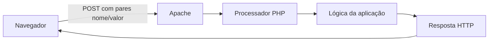
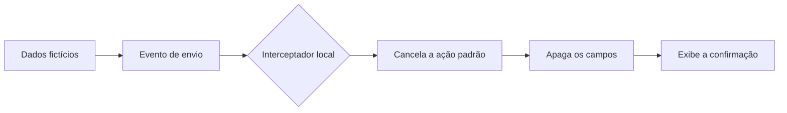

# Entendendo e controlando o envio de um formulário

> **Status:** capítulo em revisão editorial.
>
> **Título original:** Modifying The Page to Steal Login Information
>
> **Escopo:** estudo conceitual e simulação autorizada com dados fictícios. A coleta de credenciais reais demonstrada pelo instrutor não foi reproduzida.

Na [aula anterior](13-creating-a-fake-login-page-on-the-cloud.md), um arquivo chamado `index.html` foi colocado em `/var/www/html`, diretório servido pelo Apache. Esta aula parte desse arquivo para investigar uma pergunta nova: quando alguém preenche campos de uma página e pressiona o botão de entrada, quais elementos determinam para onde os valores vão?

O instrutor apresentou essa estrutura no contexto de uma página de phishing e direcionou o formulário a um arquivo PHP que receberia credenciais. No laboratório documentado aqui, o mesmo fluxo foi estudado sem capturar, transmitir ou armazenar dados. A página foi adaptada para descartar valores fictícios no próprio navegador.

## Abrindo o arquivo que o Apache entrega

No painel remoto do FileZilla, o arquivo relevante era `/var/www/html/index.html`. Ele precisava ser editado porque esse era o documento entregue pelo Apache quando o navegador acessava a raiz do servidor.

Ao escolher **Editar** no FileZilla, o programa baixou uma cópia temporária para o Windows e a abriu no editor associado à extensão `.html`. O editor não trabalhou diretamente dentro do servidor. Depois que a cópia local foi salva, o FileZilla detectou a alteração e perguntou se o arquivo deveria ser enviado de volta para substituir a versão remota.

Esse fluxo possui duas operações diferentes:

1. **Download temporário:** o FileZilla traz o arquivo remoto para o computador local.
2. **Upload da alteração:** após a confirmação, o FileZilla envia a cópia editada para `/var/www/html/index.html`.

Salvar no editor modifica primeiro a cópia temporária. A página publicada só muda quando o upload termina com sucesso.

## Relacionando a página visível ao código

O arquivo baixado continha uma quantidade grande de HTML, CSS, dados de configuração e JavaScript. Em vez de ler tudo desde o início, o instrutor abriu as ferramentas de desenvolvimento do navegador e usou **Inspecionar** sobre a região de entrada.

O painel **Elements** mostra a árvore do documento que o navegador construiu. Quando o ponteiro passa por um elemento dessa árvore, a área correspondente fica destacada na página. Isso permite relacionar uma parte visual ao elemento HTML responsável por representá-la.

Depois de encontrar um texto ou atributo suficientemente específico, é possível procurá-lo no arquivo com `Ctrl+F`. Essa busca reduz o problema: em vez de compreender imediatamente todo o documento, procura-se primeiro o contêiner que controla a região relevante.

Uma página moderna, porém, pode modificar o documento com JavaScript depois do carregamento. Por isso, o HTML exibido pelo inspetor nem sempre é uma cópia literal do arquivo salvo. O inspetor mostra o **DOM atual**, enquanto o editor mostra o **código-fonte armazenado**. Essa diferença explica por que uma busca pode encontrar uma estrutura semelhante, mas não exatamente igual.

## O papel do elemento `form`

O elemento HTML `<form>` agrupa controles cujos valores podem ser enviados juntos. Campos de texto, seletores e botões podem pertencer ao mesmo formulário.

Uma versão fictícia e inofensiva dessa estrutura seria:

```html
<form action="#" method="post" onsubmit="event.preventDefault()">
  <label for="student-id">Identificador fictício</label>
  <input id="student-id" name="student_id" type="text" />

  <label for="test-code">Código de teste</label>
  <input id="test-code" name="test_code" type="text" />

  <button type="submit">Simular</button>
</form>
```

Esse exemplo não envia informações porque `event.preventDefault()` cancela a ação padrão do navegador. O destino `#` também não aponta para um processador de dados. Os nomes e valores são deliberadamente fictícios.

### `action`: o destino da requisição

O atributo `action` informa a URL que receberia os dados quando o formulário fosse enviado pelo comportamento nativo do navegador. Ele não contém, por si só, a lógica que valida ou armazena informações. Essa lógica precisa existir no recurso localizado no destino, normalmente em uma aplicação de back-end.

Se a URL for relativa, como `processar.php`, o navegador a resolve em relação ao endereço atual. Em uma página servida na raiz do site, isso normalmente apontaria para um recurso no mesmo servidor. O navegador então iniciaria uma nova requisição HTTP para esse caminho.

### `method`: como os valores entram na requisição

O atributo `method` seleciona o método HTTP usado no envio. A aula trabalhou com `POST`, método no qual os pares de nome e valor costumam seguir no corpo da requisição.

`POST` não significa que os dados estão criptografados. Em HTTP sem TLS, o conteúdo pode atravessar a rede sem a proteção fornecida pelo HTTPS. O método define a semântica da requisição; quem protege o transporte é o TLS usado pelo HTTPS.

### `name`: a chave associada ao valor

Cada controle bem-sucedido que participa do envio precisa de um atributo `name`. Esse nome se torna a chave que acompanha o valor digitado.

No exemplo seguro, se o campo `student_id` contivesse `ALUNO-01`, o back-end poderia receber um par conceitualmente equivalente a:

```text
student_id=ALUNO-01
```

O `id` tem outra função. Ele identifica um elemento no documento e pode relacionar o campo a um `<label>`, a seletores CSS ou a JavaScript. O `name` participa da representação dos dados do formulário; o `id` identifica o elemento dentro do DOM.

## O botão de envio

Um botão com `type="submit"` solicita o envio do formulário ao qual pertence. Antes da requisição, o navegador dispara um evento chamado `submit`. JavaScript pode observar esse evento, validar campos, cancelá-lo com `preventDefault()` ou executar outro comportamento.

No arquivo estudado, o controle visível não era um `<button type="submit">` simples. A interface moderna utilizava um elemento com `role="button"`, enquanto havia um `input` de envio oculto. Essa composição dependia de JavaScript e era diferente do formulário tradicional apresentado na explicação do curso.

Essa diferença importa porque procurar apenas pela palavra `submit` não garante que o primeiro resultado seja o botão que a pessoa vê. É necessário confirmar a relação entre o resultado encontrado, o formulário e o elemento destacado no inspetor.

## Por que remover um `id` não é uma regra geral

Na demonstração, o instrutor removeu identificadores para evitar que o JavaScript original controlasse o formulário e o botão. Isso pode mudar o comportamento de uma página específica, mas não é uma regra confiável para formulários em geral.

Remover um `id` pode:

- quebrar a associação entre `<label>` e campo;
- impedir que CSS encontre o elemento;
- interromper código JavaScript legítimo;
- prejudicar acessibilidade e testes automatizados;
- não produzir efeito algum, caso o código use classes, atributos ou referências internas.

A decisão correta depende de descobrir qual código realmente observa o elemento. Alterar identificadores sem essa análise pode apenas quebrar a interface, sem controlar o fluxo de envio.

## O limite entre HTML e PHP

HTML descreve a estrutura da página no navegador. Ele não grava sozinho valores em um arquivo do servidor. Para receber uma requisição, interpretar os campos e produzir algum efeito persistente, é necessário um componente executado no lado do servidor.

Na aula, o instrutor propôs um arquivo PHP. **PHP** é uma linguagem que pode ser executada pelo servidor web quando o ambiente está configurado com um interpretador compatível. O navegador não recebe o código PHP original: ele envia uma requisição, o servidor executa o programa e devolve apenas a resposta produzida.

O fluxo conceitual apresentado foi:



Criar um arquivo com extensão `.php` não garante que ele será executado. O Apache precisa estar configurado para encaminhar esse tipo de arquivo a um interpretador PHP. Sem essa integração, a requisição pode falhar ou o servidor pode tratar o arquivo de outra forma.

O instrutor identificou os nomes dos campos e mostrou como um programa PHP poderia ler valores recebidos por `POST`. A etapa seguinte do curso pretendia gravá-los em um arquivo. Essa implementação de captura não foi incluída neste laboratório, pois credenciais são dados sensíveis e não devem ser coletadas nem mesmo em uma página pública de estudo.

## Adaptando o exercício para uma simulação segura

Para estudar o mecanismo sem criar um coletor de credenciais, o formulário foi mantido visualmente igual, mas seu envio foi neutralizado.

O arquivo original já continha:

- um `<form>` com `id="login_form"` e `method="POST"`;
- dois campos com atributos `name`;
- um controle visual de entrada comandado por JavaScript;
- um controle de envio oculto.

Em vez de apontar `action` para um arquivo PHP, foi usado um destino neutro. Uma **Content Security Policy** também bloqueou ações de formulário, conexões iniciadas pela página, objetos incorporados e mudanças da URL-base. Um interceptador carregado antes dos scripts da aplicação cancelou os eventos do formulário, apagou os campos e exibiu uma mensagem informando que nada foi enviado ou armazenado.

O fluxo validado passou a ser:



Nenhum endpoint PHP foi criado. Nenhum arquivo de credenciais foi produzido.

## Confirmando o resultado no navegador

A versão original e a versão segura foram abertas no mesmo navegador e no mesmo viewport. A comparação confirmou screenshot idêntico, além das mesmas posições, dimensões, fontes e cores para o formulário e seus controles. Isso demonstrou que os controles de segurança não mudaram o design.

O comportamento foi testado apenas com os valores fictícios `ALUNO-01` e `DEMO-1234`. Depois do acionamento do controle de entrada:

- a URL permaneceu a mesma;
- os dois campos ficaram vazios;
- apareceu uma mensagem local de conclusão;
- nenhuma requisição `POST` foi observada;
- nenhum valor foi persistido.

Depois do upload pelo FileZilla, a resposta do Apache foi baixada como bytes e comparada com o arquivo validado. Tamanho e hash SHA-256 coincidiram, confirmando que o servidor entregava exatamente a versão testada. Essa comparação prova a igualdade dos arquivos; o teste do navegador prova o comportamento observado.

## O que esta aula ensina

Um formulário conecta a interface visível a uma futura requisição HTTP. O `form` delimita o conjunto de controles, `name` define as chaves dos valores, `method` escolhe o método HTTP e `action` indica o destino. O botão de envio inicia o processo, mas JavaScript pode interceptá-lo antes que o navegador crie a requisição.

Também ficou claro que uma aplicação moderna não precisa usar somente elementos tradicionais. Componentes com funções ARIA, controles ocultos e eventos JavaScript podem compor o comportamento final. Por isso, entender o DOM e observar a rede é mais confiável do que alterar atributos por tentativa.

No lado do servidor, PHP ou outra tecnologia de back-end seria responsável por processar dados recebidos. `POST` não armazena informações automaticamente e não fornece criptografia. Persistência, validação, proteção e resposta dependem da aplicação e da configuração do servidor.

Por fim, o encerramento seguro do laboratório é parte do exercício. Uma cópia visual de uma marca não deve permanecer publicamente acessível. Depois da observação, substitua-a por uma página neutra de conscientização, restrinja a porta `80` no Security Group ou encerre a instância quando ela não for mais necessária.

## Perguntas de fixação

1. Por que salvar a cópia temporária aberta pelo FileZilla não significa, por si só, que o arquivo do Apache já foi substituído?
2. Qual é a diferença entre o código-fonte armazenado no arquivo e o DOM mostrado pelo painel **Elements** depois que o JavaScript foi executado?
3. Qual é a função do elemento `<form>` e como `action`, `method` e `name` participam da criação de uma requisição HTTP?
4. Por que `id` e `name` não são intercambiáveis, e quais comportamentos podem ser quebrados pela remoção indiscriminada de um `id`?
5. O que um controle com `type="submit"` solicita ao navegador e em que momento o evento `submit` pode ser cancelado?
6. Por que usar `POST` não significa que os dados estão criptografados, e qual tecnologia protege o conteúdo durante o transporte pela Web?
7. Por que um arquivo `.php` não é executado apenas por possuir essa extensão, e qual relação precisa existir entre Apache e o interpretador PHP?
8. Como a Content Security Policy, o cancelamento de eventos e a limpeza dos campos atuaram em camadas diferentes na simulação segura?
9. O que a comparação de hash comprovou e o que precisou ser verificado separadamente no navegador?
10. Quais medidas encerram corretamente esse laboratório e evitam que uma cópia visual enganosa permaneça exposta na Internet?