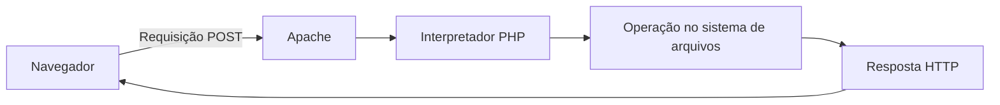

# Arquivos, permissões e redirecionamento em PHP

> **Status:** capítulo em revisão editorial.
>
> **Título original:** Stealing Facebook Login Using an Identical Fake Login Page
>
> **Escopo:** análise conceitual em laboratório próprio. O coletor de credenciais demonstrado pelo instrutor não é reproduzido; o exemplo seguro registra somente a ocorrência de uma simulação, sem copiar valores enviados.

Na [aula anterior](14-modifying-the-page-to-steal-login-information.md), o formulário foi relacionado a uma requisição `POST` e a um possível programa executado no servidor. Esta aula acompanha a etapa seguinte: abrir um arquivo, acrescentar uma linha, fechar o recurso e devolver uma resposta HTTP ao navegador.

O instrutor aplicou esses mecanismos à captura de usuário e senha em uma página clonada. Esse uso cria um coletor de credenciais e não deve ser reproduzido nem publicado. O aprendizado técnico será preservado com um evento fictício que não lê, transmite ou armazena os valores dos campos.

## Da requisição ao programa PHP

Quando o navegador envia um formulário para um recurso `.php`, o Apache precisa encaminhar a requisição a um interpretador PHP configurado. O programa é executado no servidor, não no navegador.

O fluxo geral observado foi:



O navegador não recebe o código PHP original. Ele recebe somente a resposta produzida depois da execução.

## O que representa `$_POST`

No PHP, `$_POST` é uma **superglobal**: uma variável disponibilizada automaticamente pelo ambiente em diferentes escopos do programa. Ela funciona como um array associativo que pode conter pares enviados no corpo de uma requisição de formulário compatível.

Se um controle participante possui `name="student_id"`, a aplicação poderia consultar conceitualmente `$_POST["student_id"]`. O nome do campo se torna a chave e o valor enviado se torna o conteúdo associado.

Dados recebidos dessa forma são entrada controlada pelo cliente. A aplicação não deve presumir que existem, que possuem o formato esperado ou que são seguros. Antes de utilizar uma chave, é necessário verificar o método HTTP, confirmar sua existência e aplicar validação adequada ao propósito legítimo da aplicação.

Na demonstração original, duas chaves foram copiadas diretamente para variáveis e depois gravadas como texto. Como representavam credenciais, esse fluxo não foi mantido no exemplo seguro.

## Abrindo um arquivo com `fopen`

A função `fopen` tenta abrir um arquivo e devolve um **handle**, uma referência que outras funções usam para operar sobre aquele recurso. Se a abertura falhar, o retorno é `false`.

O segundo argumento seleciona o modo de abertura. Os modos discutidos na aula têm efeitos diferentes:

| Modo | Leitura | Escrita | Cria se não existir | Preserva conteúdo anterior |
|---|---:|---:|---:|---:|
| `w` | Não | Sim | Sim | Não; trunca o arquivo ao abrir |
| `a` | Não | Sim | Sim | Sim; novas escritas vão para o final |
| `a+` | Sim | Sim | Sim | Sim; novas escritas vão para o final |

A explicação do curso tratou `a+` apenas como “acrescentar”. A precisão importante é que o sinal `+` também habilita leitura. Quando o programa só precisa acrescentar uma linha, `a` costuma expressar melhor essa intenção.

## Montando uma linha de texto

O operador `.` concatena valores em PHP. Concatenar significa construir uma sequência juntando partes menores. O trecho `"evento: " . $tipo`, por exemplo, combina um texto literal com o conteúdo da variável.

Dentro de uma string com aspas duplas, `\n` representa uma quebra de linha. Isso permite separar registros em um arquivo textual. A sequência não é a mesma coisa que pressionar fisicamente uma tecla: o PHP insere no texto o caractere de nova linha apropriado à expressão.

Qualquer valor vindo do usuário continuaria sendo não confiável mesmo depois da concatenação. Além do risco de armazenar segredos, quebras de linha e outros caracteres recebidos sem tratamento podem forjar registros e dificultar a interpretação de logs.

## Escrevendo e fechando o recurso

`fwrite` recebe um handle e uma string. Seu retorno informa quantos bytes foram gravados ou `false` em caso de falha. Verificar esse retorno é mais confiável do que presumir sucesso porque uma página não exibiu erro.

`fclose` solicita o fechamento do handle. Isso libera o recurso mantido pelo processo e conclui o uso daquele descritor. A analogia com clicar no `X` ajuda a introduzir a ideia, mas tecnicamente o programa está encerrando sua referência ao arquivo no sistema operacional.

Quando mais de uma requisição pode escrever simultaneamente, também é necessário considerar **locking**, ou bloqueio de acesso concorrente. Sem coordenação, registros de processos diferentes podem se misturar. Em PHP, `flock` pode solicitar um bloqueio exclusivo durante uma escrita simples em arquivo.

## Por que a primeira escrita falhou

O upload por SFTP havia sido realizado como usuário `kali`. A requisição HTTP, porém, era processada pelo serviço web com outra identidade do sistema, normalmente uma conta restrita como `www-data` em distribuições baseadas em Debian.

Essas identidades não são intercambiáveis:

- **`kali`:** usuário autenticado na sessão SSH ou SFTP;
- **processo do Apache/PHP:** identidade usada para atender a requisição web;
- **proprietário e grupo do diretório:** metadados que participam da decisão de acesso;
- **bits de permissão:** operações permitidas ao proprietário, ao grupo e aos demais usuários.

Assim, conseguir enviar um arquivo com FileZilla não prova que o processo web poderá criar outro arquivo no mesmo diretório. A mensagem de falha na abertura indicava que caminho, existência do diretório ou permissões ainda precisavam ser investigados.

## Por que `777` não é uma correção adequada

Na aula, o instrutor criou um diretório e atribuiu permissão `777`. Em notação octal, cada `7` concede leitura, escrita e execução; aplicado a um diretório, isso permite que proprietário, grupo e demais usuários listem conforme outras condições, criem ou removam entradas e atravessem o caminho.

Essa permissão é excessiva para uma aplicação real. Ela troca um diagnóstico de propriedade por escrita ampla e aumenta o impacto de qualquer processo ou conta comprometida no sistema.

Uma configuração adequada segue **menor privilégio**:

- o processo recebe escrita somente no local realmente necessário;
- o diretório de log fica fora do document root, para não ser baixado por HTTP;
- proprietário e grupo representam as identidades que administram e usam o recurso;
- as permissões não concedem escrita a todos os usuários;
- segredos nunca são registrados em texto puro.

O número exato depende de proprietário, grupo, umask e arquitetura da aplicação. Copiar `777` sem compreender essas relações não resolve a causa de forma segura.

## Redirecionando depois de um `POST`

A função `header` adiciona um cabeçalho à resposta HTTP. Um cabeçalho `Location` orienta o navegador a fazer uma nova requisição para outra URL.

Os cabeçalhos precisam ser definidos antes que o PHP envie conteúdo ao corpo da resposta. Espaços, mensagens de erro ou HTML enviados antes podem causar o aviso conhecido como **headers already sent**.

Depois de processar um `POST`, uma aplicação legítima pode responder com status `303 See Other`. Esse status orienta o navegador a buscar a página de destino com `GET`, evitando repetir o corpo do formulário ao atualizar a página. Depois de enviar o cabeçalho, `exit` encerra explicitamente o script e impede execução acidental de código posterior.

Na demonstração ofensiva, o redirecionamento externo servia para ocultar o que havia acontecido. No laboratório seguro, o destino deve ser uma página local de conclusão claramente identificada como simulação.

## Um equivalente seguro para o laboratório

O exemplo seguinte preserva abertura, append, bloqueio, escrita, fechamento e redirecionamento. Ele não acessa `$_POST` e não registra nenhum valor fornecido pelo visitante. A linha gravada contém somente horário e um rótulo fixo de simulação.

O arquivo de log fica fora do diretório publicado. O caminho é ilustrativo e exige que o administrador crie o diretório com proprietário, grupo e permissões mínimas adequadas ao processo web.

```php
<?php

declare(strict_types=1);

if ($_SERVER["REQUEST_METHOD"] !== "POST") {
    http_response_code(405);
    exit;
}

$logPath = "/var/log/training-app/events.log";
$handle = fopen($logPath, "a");

if ($handle === false) {
    http_response_code(500);
    exit;
}

flock($handle, LOCK_EX);
$written = fwrite(
    $handle,
    gmdate(DATE_ATOM) . " simulated_submission\n"
);
flock($handle, LOCK_UN);
fclose($handle);

if ($written === false) {
    http_response_code(500);
    exit;
}

header("Location: /training-complete.html", true, 303);
exit;
```

`declare(strict_types=1)` habilita verificação mais estrita em determinadas conversões de tipos do PHP. A condição inicial aceita somente `POST`; outros métodos recebem `405 Method Not Allowed`.

`fopen` abre o log em modo append. A comparação explícita com `false` confirma se o handle foi criado. `flock` solicita bloqueio exclusivo, `fwrite` acrescenta o evento fixo e `fclose` encerra o recurso. Por fim, `header` envia o redirecionamento local com status `303` e `exit` termina o programa.

Esse código não torna o ambiente automaticamente seguro. O diretório ainda precisa existir, não pode ser servido pela Web e deve possuir permissões mínimas. A página `/training-complete.html` também precisa existir no próprio laboratório.

## O que a captura do laboratório demonstra

A captura apresentada nesta aula mostrava um arquivo textual com pares semelhantes a credenciais. Ela não foi incorporada ao livro porque contém endereços e valores que podem ser confundidos com dados reais. Evidências públicas devem ser sanitizadas antes da publicação.

O resultado visual de uma linha aparecer no arquivo comprova que alguma escrita ocorreu. Ele não comprova sozinho:

- que todos os bytes foram gravados sem concorrência;
- que o arquivo está protegido contra download por HTTP;
- que as permissões seguem menor privilégio;
- que dados sensíveis foram tratados legalmente;
- que o redirecionamento posterior possui finalidade legítima.

Se qualquer senha verdadeira foi usada durante o teste, ela deve ser considerada exposta: altere-a no serviço correspondente, encerre sessões ativas e remova as cópias armazenadas no servidor e no computador local.

## Encerrando o laboratório

Ao terminar, remova o endpoint de teste, o arquivo com dados submetidos e qualquer cópia visual de marca. Substitua a página por uma tela neutra de conscientização, restrinja a porta `80` ou encerre a instância e confira custos pendentes na conta de nuvem.

O aprendizado central desta aula não é armazenar senhas. É compreender que uma requisição web passa a executar código com a identidade e as permissões do processo servidor; esse código pode abrir recursos, escrever bytes, falhar por autorização e controlar a resposta HTTP. Cada uma dessas capacidades precisa de limites explícitos.