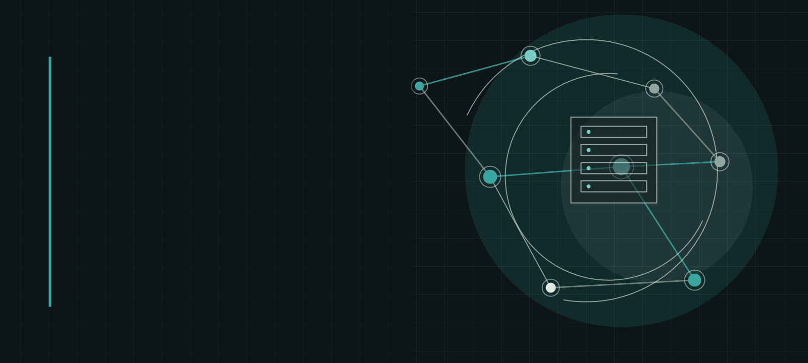

---
hide:
    - toc
    - path
---

<section class="book-cover" markdown>

# Segurança ofensiva autorizada na nuvem

Fundamentos de cibersegurança, infraestrutura em nuvem e laboratórios controlados para quem está começando.

[Começar a leitura :material-arrow-right:](01-introduction-to-cloud-computing-for-hackers/01-teaser.md){ .md-button .md-button--primary }

</section>

<aside class="ethics-note">
    !
    

        <strong>Uso autorizado</strong>
        
Os procedimentos destinam-se exclusivamente a sistemas próprios, CTFs, laboratórios isolados ou ambientes cobertos por autorização explícita.

    

</aside>

## Três módulos para construir a base

Cada etapa introduz os conceitos necessários para a seguinte, sem presumir experiência anterior com redes, Linux ou nuvem.

    <a class="module-row" href="01-introduction-to-cloud-computing-for-hackers/01-teaser/">
        
            <strong>Contexto e fundamentos</strong>
            Escopo, hacking ético, Red Team e o funcionamento real da computação em nuvem.
        
        4 aulas
        &rarr;
    </a>
    <a class="module-row" href="02-cloud-basics/05-introduction-to-cloud-basics/">
        
            <strong>Fundamentos da nuvem</strong>
            Conta AWS, instância Kali, acesso remoto com SSH e fundamentos do terminal Linux.
        
        5 aulas
        &rarr;
    </a>
    <a class="module-row" href="03-phishing/10-introduction-to-phishing/">
        
            <strong>Phishing e infraestrutura web</strong>
            Engenharia social, publicação HTTP e transferência SFTP em laboratório seguro.
        
        3 aulas
        &rarr;
    </a>

<section class="edition-note">
    

        <strong>12 aulas revisadas</strong>
    

    
Os capítulos seguintes permanecem como rascunhos até passarem por revisão técnica, ética e editorial.

</section>